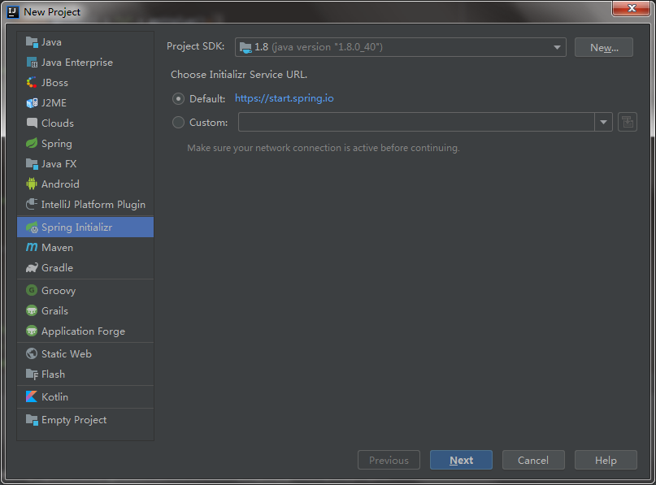
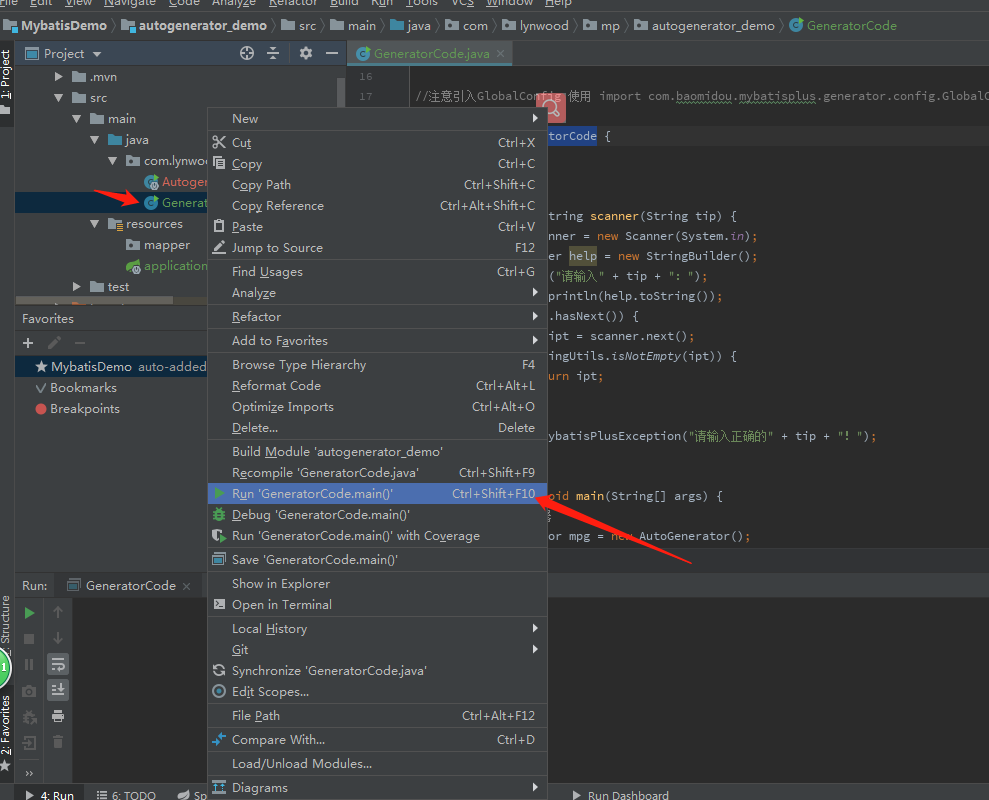
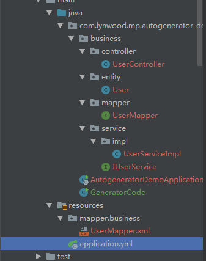
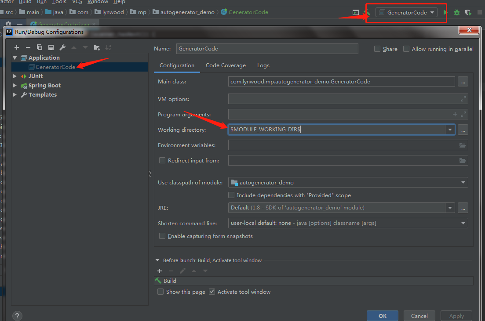
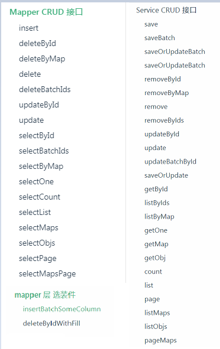
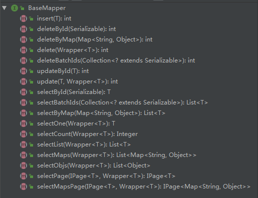
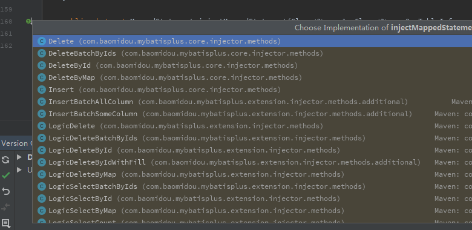

# Mybatis-Plus 我来填坑~


#### 目录:

[TOC]

#### 简介： 

​	此Demo 主要应用SpringBoot 来展示**Mybatis-Plus** 特性， 以及在开发过程中可能应用到的插件的演示。

​	**本文：https://github.com/wunian7yulian/MybatisDemo**

------

- **相同于 [MyBatis官方指南](https://mybatis.plus/guide/) 中有了详细介绍**

	 **不同于 实践演示**	

------

- **目的:**

   主要借此做为突破口， **一是**将自我学习成文记录下来， **二是**将Demo 慢慢做成一个自己或者面向大众的后端脚手架工具。

- **规划**：

   *分享-实践-填坑-总结-脚手架-分享-实践......*  

   ​	

## 一、简单介绍

### 官方说明 ：

Mybatis-Plus（简称MP）是一个Mybatis的增强工具，在 Mybatis 的基础上只做增强不做改变，为简化开发而生！

- #### 润物无声

  只做增强不做改变，引入它不会对现有工程产生影响。

- #### 效率至上

  只需简单配置，即可快速进行 CRUD 操作，从而节省大量时间。

- #### 丰富功能

  热加载、代码生成、分页、性能分析等功能一应俱全。

### 成绩：

MyBatis-Plus 荣获[【2018年度开源中国最受欢迎的中国软件】](https://www.oschina.net/question/2896879_2290300) TOP5 	​	

### 最新版本：

``` xml
<dependency>
    <groupId>com.baomidou</groupId>
    <artifactId>mybatis-plus</artifactId>
    <version>3.0.7.1</version>
</dependency>
```

### 开发层面MyBatis-Plus特色

1. **代码生成**
2. **条件构造器**

### Mybatis-Plus中的Plus

官方简介说明 MP 和Mybatis 就像是 游戏中的p1 和p2 一样 兄弟搭配 干活不累 、

我在使用中明显感觉到 其实他更像是 马里奥和蘑菇  吃了蘑菇 我们跳的高度更高了一些。

## 二、MP的特性

- **无侵入**：只做增强不做改变，引入它不会对现有工程产生影响，如丝般顺滑
- **损耗小**：启动即会自动注入基本 CURD，性能基本无损耗，直接面向对象操作
- **强大的 CRUD 操作**：内置通用 Mapper、通用 Service，仅仅通过少量配置即可实现单表大部分 CRUD 操作，更有强大的条件构造器，满足各类使用需求
- **支持 Lambda 形式调用**：通过 Lambda 表达式，方便的编写各类查询条件，无需再担心字段写错
- **内置代码生成器**：采用代码或者 Maven 插件可快速生成 Mapper 、 Model 、 **Service 、 Controller** 层代码，支持模板引擎，更有超多自定义配置等您来使用
- **内置分页插件**：基于 MyBatis 物理分页，开发者无需关心具体操作，配置好插件之后，写分页等同于普通 List 查询
- **内置全局拦截插件**：提供全表 delete 、 update 操作智能分析阻断，也可自定义拦截规则，预防误操作
- **支持多种数据库**：支持 MySQL、MariaDB、Oracle、DB2、H2、HSQL、SQLite、Postgre、SQLServer2005、SQLServer 等多种数据库
- **支持主键自动生成**：支持多达 4 种主键策略（`内含分布式唯一 ID 生成器 - Sequence`），可自由配置，完美解决主键问题
- **支持 XML 热加载**：<u>Mapper 对应的 XML 支持热加载，对于简单的 CRUD 操作</u>，甚至可以无 XML 启动

- **支持 ActiveRecord 模式**：支持 ActiveRecord 形式调用，实体类只需继承 Model 类即可进行强大的 CRUD 操作
- **支持自定义全局通用操作**：支持全局通用方法注入（ Write once, use anywhere ）
- **支持关键词自动转义**：支持数据库关键词（order、key......）自动转义，还可自定义关键词
- **内置性能分析插件**：可输出 Sql 语句以及其执行时间，建议开发测试时启用该功能，能快速揪出慢查询
- **内置 Sql 注入剥离器**：支持 Sql 注入剥离，有效预防 Sql 注入攻击

## 三、MP框架结构


## 四、简单的入门Demo(Mysql)

#### Demo代码地址：

https://github.com/wunian7yulian/MybatisDemo/tree/master/simpledemo

#### Demo 环境： 

​	windows 7

​	jdk 1.8.0.40

​	idea Ultimate 

​	maven 3.3.9	

#### 初始化：

##### 数据库：MySql

创建数据库`mp_demo_db`设置字符集 utf-8

###### DDL:

```sql
-- 创建简单表格
DROP TABLE IF EXISTS user;

CREATE TABLE `user` (
  `id` bigint(20) PRIMARY KEY AUTO_INCREMENT  COMMENT '主键ID',
  `name` varchar(30) DEFAULT NULL COMMENT '姓名',
  `age` int(11) DEFAULT NULL COMMENT '年龄',
  `email` varchar(50) DEFAULT NULL COMMENT '邮箱'
) ENGINE=InnoDB DEFAULT CHARSET=utf8;


```

###### DML:

```sql
-- 初始化数据
DELETE FROM user;

INSERT INTO user (id, name, age, email) VALUES
(1, 'Jone', 18, 'test1@baomidou.com'),
(2, 'Jack', 20, 'test2@baomidou.com'),
(3, 'Tom', 28, 'test3@baomidou.com'),
(4, 'Sandy', 21, 'test4@baomidou.com'),
(5, 'Billie', 24, 'test5@baomidou.com');
```

#### 工程：

​	为了方便快捷 选用 SpringBoot 工程作为Demo支撑

##### 第一步、创建工程



输入项目包名 并**添加mysql模块** 创建完毕。

##### 第二步、引入依赖坐标

```xml
 <dependency>
            <groupId>org.springframework.boot</groupId>
            <artifactId>spring-boot-starter</artifactId>
        </dependency>
        <dependency>
            <groupId>org.springframework.boot</groupId>
            <artifactId>spring-boot-starter-test</artifactId>
            <scope>test</scope>
        </dependency>
        <dependency>
            <groupId>mysql</groupId>
            <artifactId>mysql-connector-java</artifactId>
            <scope>runtime</scope>
        </dependency>

        <dependency>
            <groupId>org.projectlombok</groupId>
            <artifactId>lombok</artifactId>
            <optional>true</optional>
        </dependency>
        <dependency>
            <groupId>com.baomidou</groupId>
            <artifactId>mybatis-plus-boot-starter</artifactId>
            <version>3.0.7.1</version>
        </dependency>
        <!--手动添加模板引擎-->
        <dependency>
            <groupId>org.freemarker</groupId>
            <artifactId>freemarker</artifactId>
            <version>2.3.20</version>
        </dependency>
        <dependency>
            <groupId>com.baomidou</groupId>
            <artifactId>mybatis-plus-generator</artifactId>
            <version>3.0.6</version>
        </dependency>
        <dependency>
            <groupId>com.baomidou</groupId>
            <artifactId>mybatis-plus-core</artifactId>
            <version>3.0.7.1</version>
        </dependency>
```

##### 第三步、配置数据源

在 `application.yml` 配置文件中添加相关配置：

```yaml
# DataSource Config
spring:
  datasource:
    # 这里如果有错误是因为 maven mysql包 选择了 runtime 形式的 scope  可以不用管它 继续下一步就好
    driver-class-name: com.mysql.jdbc.Driver
    url: jdbc:mysql://127.0.0.1:3306/mp_demo_db?characterEncoding=utf8
    username: root
    password: 123456
```

##### 第四步、添加mybatis扫描位置

```java

@SpringBootApplication
@MapperScan("com.lynwood.mp.simpledemo.mapper")
public class SimpledemoApplication {

    public static void main(String[] args) {
        SpringApplication.run(SimpledemoApplication.class, args);
    }

}
```

##### 第五步、pojo及mapper

pojo:

```java
import lombok.Data;

@Data
public class User {
    private Long id;
    private String name;
    private Integer age;
    private String email;
}
```

mapper:

```java
import com.baomidou.mybatisplus.core.mapper.BaseMapper;
import com.lynwood.mp.simpledemo.model.User;

public interface UserMapper extends BaseMapper<User> {

}
```

##### 第六步、测试

```java
@RunWith(SpringRunner.class)
@SpringBootTest
public class SampleTest {

    @Autowired
    private UserMapper userMapper;

    @Test
    public void testSelect() {
        List<User> userList = userMapper.selectList(null);
        Assert.assertEquals(5, userList.size());
        userList.forEach(System.out::println);
    }

}
```

运行结果：

```java
User{id=1, name='Jone', age=18, email='test1@baomidou.com'}
User{id=2, name='Jack', age=20, email='test2@baomidou.com'}
User{id=3, name='Tom', age=28, email='test3@baomidou.com'}
User{id=4, name='Sandy', age=21,email='test4@baomidou.com'}
User{id=5, name='Bill', age=24,email='test5@baomidou.com'}
```

## 五、核心功能

### 核心一-简便之-代码生成器（AutoGenerator）

​	AutoGenerator 是 MyBatis-Plus 的代码生成器，通过 AutoGenerator 可以快速生成 Entity、Mapper、Mapper XML、Service、Controller 等各个模块的代码，极大的提升了开发效率。

#### Demo代码地址：

https://github.com/wunian7yulian/MybatisDemo/tree/master/simpledemo

#### Demo 环境： 

​	同上

#### 工程：

​	

##### 第一步、创建模块

​	创建了autogenerator_demo模块（记得**添加mysql模块** ）作为演示代码生成器功能配置。

##### 第二步、引入依赖坐标

```xml
<dependency>
    <groupId>com.baomidou</groupId>
    <artifactId>mybatis-plus-boot-starter</artifactId>
    <version>3.0.7.1</version>
</dependency>
<!--手动添加模板引擎-->
<dependency>
    <groupId>org.freemarker</groupId>
    <artifactId>freemarker</artifactId>
    <version>2.3.20</version>
</dependency>
<dependency>
    <groupId>com.baomidou</groupId>
    <artifactId>mybatis-plus-generator</artifactId>
    <version>3.0.6</version>
</dependency>
```

**注意**：MP `3.0.3` 之后移除了自动模板引擎依赖，需要**手动添加**对应**模板引擎**

##### 第三步、编写代码生成器

​	直接复制就行啦！

```java
package com.lynwood.mp.autogenerator_demo;

import com.baomidou.mybatisplus.core.exceptions.MybatisPlusException;
import com.baomidou.mybatisplus.core.toolkit.StringPool;
import com.baomidou.mybatisplus.core.toolkit.StringUtils;
import com.baomidou.mybatisplus.generator.AutoGenerator;
import com.baomidou.mybatisplus.generator.InjectionConfig;
import com.baomidou.mybatisplus.generator.config.*;
import com.baomidou.mybatisplus.generator.config.po.TableInfo;
import com.baomidou.mybatisplus.generator.config.rules.NamingStrategy;
import com.baomidou.mybatisplus.generator.engine.FreemarkerTemplateEngine;

import java.util.ArrayList;
import java.util.List;
import java.util.Scanner;

//注意引入GlobalConfig 使用 import com.baomidou.mybatisplus.generator.config.*;

public class GeneratorCode {
    /**
     * 读取控制台内容
     */
    public static String scanner(String tip) {
        Scanner scanner = new Scanner(System.in);
        StringBuilder help = new StringBuilder();
        help.append("请输入" + tip + "：");
        System.out.println(help.toString());
        if (scanner.hasNext()) {
            String ipt = scanner.next();
            if (StringUtils.isNotEmpty(ipt)) {
                return ipt;
            }
        }
        throw new MybatisPlusException("请输入正确的" + tip + "！");
    }

    public static void main(String[] args) {
        // 代码生成器
        AutoGenerator mpg = new AutoGenerator();

        // 全局配置
        GlobalConfig gc = new GlobalConfig();
        String projectPath = System.getProperty("user.dir");
        gc.setOutputDir(projectPath + "/src/main/java");
        gc.setAuthor("Lynwood");
        gc.setOpen(false);
        mpg.setGlobalConfig(gc);

        // 数据源配置
        DataSourceConfig dsc = new DataSourceConfig();
        dsc.setUrl("jdbc:mysql://127.0.0.1:3306/mp_demo_db?useUnicode=true&useSSL=false&characterEncoding=utf8");
        // dsc.setSchemaName("public");
        dsc.setDriverName("com.mysql.jdbc.Driver");
        dsc.setUsername("root");
        dsc.setPassword("123456");
        mpg.setDataSource(dsc);

        // 包配置
        PackageConfig pc = new PackageConfig();
        pc.setModuleName(scanner("模块名"));
        pc.setParent("com.lynwood.mp.autogenerator_demo");
        mpg.setPackageInfo(pc);

        // 自定义配置
        InjectionConfig cfg = new InjectionConfig() {
            @Override
            public void initMap() {
                // to do nothing
            }
        };

        // 如果模板引擎是 freemarker
        String templatePath = "/templates/mapper.xml.ftl";
        // 如果模板引擎是 velocity
        // String templatePath = "/templates/mapper.xml.vm";

        // 自定义输出配置
        List<FileOutConfig> focList = new ArrayList<>();
        // 自定义配置会被优先输出
        focList.add(new FileOutConfig(templatePath) {
            @Override
            public String outputFile(TableInfo tableInfo) {
                // 自定义输出文件名
                return projectPath + "/src/main/resources/mapper/" + pc.getModuleName()
                        + "/" + tableInfo.getEntityName() + "Mapper" + StringPool.DOT_XML;
            }
        });

        cfg.setFileOutConfigList(focList);
        mpg.setCfg(cfg);

        // 配置模板
        TemplateConfig templateConfig = new TemplateConfig();

        // 配置自定义输出模板
        // templateConfig.setEntity();
        // templateConfig.setService();
        // templateConfig.setController();

        templateConfig.setXml(null);
        mpg.setTemplate(templateConfig);

        // 策略配置
        StrategyConfig strategy = new StrategyConfig();
        strategy.setNaming(NamingStrategy.underline_to_camel);
        strategy.setColumnNaming(NamingStrategy.underline_to_camel);
        strategy.setSuperEntityClass(null);
        strategy.setEntityLombokModel(true);
        strategy.setRestControllerStyle(true);
        strategy.setSuperControllerClass(null);
        strategy.setInclude(scanner("表名"));
        strategy.setSuperEntityColumns(null);
        strategy.setControllerMappingHyphenStyle(true);
        strategy.setTablePrefix(pc.getModuleName() + "_");
        mpg.setStrategy(strategy);
        mpg.setTemplateEngine(new FreemarkerTemplateEngine());
        mpg.execute();
    }

}

```

##### 第四步、运行测试




在控制台输入：


就可以生成代码啦！  

都包含 ：



##### **发现问题**： 如果是多模块项目 生成的文件会直接到了父项目目录下

​	原因是：在代码的全局配置中 `String projectPath = System.getProperty("user.dir");` 获取**Working Directory**时 返回的是项目路径，并非模块路径！

###### 解决方法：

​	我们可以设定运行参数选项




将 **Working Directory** 调整为 **<u>当前模块目录</u>** 再次运行就ok了！


- 因为没有引入mvc 模块 以至于@Controller 会飘红  再Demo中就没有将生成代码传入  大可拉取代码本地使用！

- 相关代码生成器的配置：[官方生成器配置](https://mybatis.plus/config/generator-config.html) 可配置项过多无法详细介绍 有相关使用会提及

### 核心二 - 清晰之-CRUD接口

#### Demo代码地址：

https://github.com/wunian7yulian/MybatisDemo/tree/master/mp_crud_demo


​	Mybatis-Plus 为我们提供了丰富的 增删改查接口 

​	我们可以分为三类 **Mapper的CRUD接口**、**Service的CRUD接口**和**mapper层选装件接口**：



​	确实比较丰富 ， 下面会以具有代表性的例子来使用 演示 作为Demo主要内容

#### 工程：

##### 第一步、创建模块

​	创建mp_crud_demo模块 选择mysql 

##### 第二步、引入依赖坐标

​	因为需要生成表对应Pojo 还需要代码生成器  

​	然后我们将上面的直接拷贝一下 

```xml
<dependency>
    <groupId>com.baomidou</groupId>
    <artifactId>mybatis-plus-boot-starter</artifactId>
    <version>3.0.7.1</version>
</dependency>
<!--手动添加模板引擎-->
<dependency>
    <groupId>org.freemarker</groupId>
    <artifactId>freemarker</artifactId>
    <version>2.3.20</version>
</dependency>
<dependency>
    <groupId>com.baomidou</groupId>
    <artifactId>mybatis-plus-generator</artifactId>
    <version>3.0.6</version>
</dependency>
```

​	再添加 lombok 依赖(因：生成代码中的实体默认是使用@Data 等注解的)

```xml
 <dependency>
     <groupId>org.projectlombok</groupId>
     <artifactId>lombok</artifactId>
     <optional>true</optional>
</dependency>
```

##### 第三步、生成代码

- **复制**上一Demo<u>模块生成器</u>**代码**
- **更改模块名**称使之对应 ` pc.setParent("com.lynwood.mp.mp_crud_demo"); `
- **设置Working Directory** 为**当前模块** 防止文件输出位置错误
- 运行**获取代码**
- **删除**不必要用到的**controller层**

##### 第四步、其他配置需要

- 设定mybatis扫描位置

   在`MpCrudDemoApplication` 上**添加注解**：`@MapperScan("com.lynwood.mp.mp_crud_demo.*.mapper**")`

   **注意 扫描包的位置**！

- **配置数据源**：

  ```yaml
  # DataSource Config
  spring:
    datasource:
    # 这里如果有错误是因为 maven mysql包 选择了 runtime 形式的 scope  可以不用管它 继续下一步就好
      driver-class-name: com.mysql.jdbc.Driver
      url: jdbc:mysql://127.0.0.1:3306/mp_demo_db?characterEncoding=utf-8
      username: root
      password: 123456
  ```

##### 第五步、对MP探个究竟！

​	<u>**以`userMapper `作为范例**</u>

- 查看`UserMapper`:

  打开`UserMapper.java`源代码:

  ```java
  public interface UserMapper extends BaseMapper<User> {
  }
  
  ```

  不难发现它**继承了**`BaseMapper<User>` 接口 

  打开`com.baomidou.mybatisplus.core.mapper.BaseMapper<T>` 

  查看当前接口的结构(Structure): 

  

  **原来**是MP 将之前的mybatis里面**每个mapper的所有方法** 经过**泛型**进行提炼到了一个BaseMapper 接口中,我们**只需要将自己的mapper 继承此接口且将泛型指定便可获得强大的CRUD功能**!

- 再去查看`UserMapper.xml` 文件 :

``` java
<?xml version="1.0" encoding="UTF-8"?>
<!DOCTYPE mapper PUBLIC "-//mybatis.org//DTD Mapper 3.0//EN" "http://mybatis.org/dtd/mybatis-3-mapper.dtd">
<mapper namespace="com.lynwood.mp.mp_crud_demo.business.mapper.UserMapper">

</mapper>
```

​	**完全丢弃了`Mybatis`中字段映射以及一段段复杂的配置!**

------

##### **发现问题**:  我虽然看到了方法 但是并没有一条SQL 那么它是怎样做到查询的呢?

###### 探索:

- ***首先*** 在项目搭建的时候添加了 坐标:

```xml
       <dependency>
            <groupId>com.baomidou</groupId>
            <artifactId>mybatis-plus-boot-starter</artifactId>
            <version>3.0.7.1</version>
        </dependency>
```

我们进入`mybatis-plus-boot-starter`的pom 发现他帮我们装配了对应版本的`mybatis-plus` 并且依赖了其他 例如: `spring-boot-autoconfigure``spring-boot-starter-jdbc`等;

因为**了解**`SpringBoot`中**配置入口**是一个`@Configuration` 

那么**打开**`mybatis-plus-boot-starter`的`jar`包 **看到**:`MybatisPlusAutoConfiguration.java`:

```java
...
public class MybatisPlusAutoConfiguration {
 ...
    @Bean
    @ConditionalOnMissingBean
    public SqlSessionFactory sqlSessionFactory(DataSource dataSource) throws Exception {
     ...
         
        if (this.applicationContext.getBeanNamesForType(ISqlInjector.class, false, false).length > 0) {
            ISqlInjector iSqlInjector = (ISqlInjector)this.applicationContext.getBean(ISqlInjector.class);
            globalConfig.setSqlInjector(iSqlInjector);
        }

        factory.setGlobalConfig(globalConfig);
        return factory.getObject();
 }
...
}
```

看到它在设置`sqlSessionFactory`的时候为我们**指定**了一个`com.baomidou.mybatisplus.core.injector.ISqlInjector.class` **作为**`factory.globalConfig.sqlInjector`(**SQL注入器**)

 ***然后*** 我们打开:`ISqlInjector`的实现类`AbstractSqlInjector`

```java
...
    public abstract class AbstractSqlInjector implements ISqlInjector {
        ...
            public void inspectInject(MapperBuilderAssistant builderAssistant, Class<?> mapperClass) {
            ...
            List<AbstractMethod> methodList = this.getMethodList();
            Assert.notEmpty(methodList, "No effective injection method was found.", new Object[0]);
       
            methodList.forEach((m) -> {
                m.inject(builderAssistant, mapperClass);
            });
            ...
        }
    }
```

`methodList` 是所有的方法的一个集合 其**元素类型**都是`AbstractMethod.class`类型的, 并且对**每个方法都进行了**`inject(...)`,

那么查看`inject()`方法源码:

```java
public void inject(MapperBuilderAssistant builderAssistant, Class<?> mapperClass) {
   ...
        this.injectMappedStatement(mapperClass, modelClass, tableInfo);
    }
}
```

**原来最终调用**了`injectMappedStatement()`方法   

**然而** 

```java
public abstract MappedStatement injectMappedStatement(Class<?> var1, Class<?> var2, TableInfo var3);
```

是**抽象的** 需要自己的子类**去实现**的  



我们**以**其中一个 `SelectById.class`  作为**例子**查看

```java
  public MappedStatement injectMappedStatement(Class<?> mapperClass, Class<?> modelClass, TableInfo tableInfo) {
        SqlMethod sqlMethod = SqlMethod.SELECT_BY_ID;
        SqlSource sqlSource = new RawSqlSource(this.configuration, String.format(sqlMethod.getSql(), this.sqlSelectColumns(tableInfo, false), tableInfo.getTableName(), tableInfo.getKeyColumn(), tableInfo.getKeyProperty()), Object.class);
        return this.addSelectMappedStatement(mapperClass, sqlMethod.getMethod(), sqlSource, modelClass, tableInfo);
    }

```

**再去查看** `SqlMethod.SELECT_BY_ID;`: 

```java
SELECT_BY_ID("selectById", "根据ID 查询一条数据", "SELECT %s FROM %s WHERE %s=#{ %s}"),
```

*soga~*

***结束*** 最后实际上 MP将SQL语句 封装了**固定的模板** `com.baomidou.mybatisplus.core.enums.SqlMethod` 从而提供给了我们便捷的使用!

##### 第六步、使用它

​	我们使用**非Wrapper**的具有代表性的接口作为Demo的演示

​	Wrapper 在后面会有单独的Demo演示


###### Mapper - 简单的CRUD:

```java
@RunWith(SpringRunner.class)
@SpringBootTest
public class MpCrudDemoApplicationTests {

    @Autowired
    private UserMapper userMapper;

    @Test
    public void simplenessMapperCURD() {
        //增加
        User addUser = new User();
        addUser.setAge(18);
        addUser.setEmail("wunian_@hotmail.com");
        addUser.setName("Lynwood");
        userMapper.insert(addUser); // insert 之后是将id装配到实体对象里的
        System.out.println("add:\n" + addUser);
        // User(id=1082883152404103169, name=Lynwood, age=18, email=wunian_@hotmail.com)
        // id = 1082883152404103169  之所以这么长是因为  MP底层给我们自己以uuid 的形式添加了 user对象的id属性

        //修改
        User updateUser = new User();
        updateUser.setId(1082883152404103169L);
        updateUser.setName("ok?");
        userMapper.updateById(updateUser);
        System.out.println("update:\n" + updateUser);
        //  User(id=1082883152404103169, name=ok?, age=null, email=null)
        // 刷新数据库 更改成功 但是没有讲其他对象进行装配

        //查询
        User selectUser = userMapper.selectById(1082883152404103169L);
        System.out.println("select:\n" + selectUser);
        //User(id=1082883152404103169, name=ok?, age=18, email=wunian_@hotmail.com)

        //删除
        int i = userMapper.deleteById(1082883152404103169L);
        if (i==1){
            System.out.println("delete:\n" + "删除成功!");
            //刷新库 删除成功
        }
    }
}
```

##### **发现问题**: 虽然MP替我生成了 uuid 作为主键,但是还是想用数据库自增形式主键怎么办?

###### 解决:

MP提供的主键策略有:

- AUTO 数据库ID自增
- INPUT 用户输入ID
- ID_WORKER 全局唯一ID，Long类型的主键
- ID_WORKER_STR 字符串全局唯一ID
- UUID 全局唯一ID，UUID类型的主键
- NONE 该类型为未设置主键类型

MP的主键策略**默认**使用的是`ID_WORKER` (详情:https://mybatis.plus/config/#idtype)

在User 中**设定 id字段**为`@TableId(type = IdType.AUTO)` 

或者 **全局设置 使用主键策略**,在yaml 添加:

```yaml
mybatis-plus:
  global-config:
    db-config:
      id-type: auto
```

**重要**:  **因为刚才的测试插入了id为:`1082883152404103169`的 数据 我们需要将自增序列首先恢复正常! 否则下一个id为1082883152404103170 看上去也是乱的!!  小心坑哈~  **

```sql
delete from user;
alter table user auto_increment= 1;
```

尝试 增加操作  输出: 

```CQL
add:
User(id=1, name=Lynwood, age=18, email=wunian_@hotmail.com)
```

###### Mapper - 批量的CRUD接口:

​	填充测试数据: 

```sql
DELETE FROM user;
INSERT INTO user ( name, age, email) VALUES
( 'Lynwood',18,'wunian_@hotmail.com')
( 'Jone', 18, 'test1@baomidou.com'),
( 'Jack', 20, 'test2@baomidou.com'),
( 'Tom', 28, 'test3@baomidou.com'),
( 'Sandy', 21, 'test4@baomidou.com'),
( 'Billie', 24, 'test5@baomidou.com');
```

测试:

```java
 @Test
    public void batchMapperCURD() {
        // 多id 查询
        List<Long> idList = new ArrayList<>();
        idList.add(1L);
        idList.add(3L);
        List<User> userList = userMapper.selectBatchIds(idList);// id的多个查询
        System.out.println("selectBatch:" );
        userList.forEach(System.out::println);
        //User(id=1, name=Lynwood, age=18, email=wunian_@hotmail.com)
        //User(id=3, name=Jack, age=20, email=test2@baomidou.com)

        // 多条件  查询
        Map<String,Object> stringObjectMap = new HashMap<>();
        stringObjectMap.put("age",18);
        stringObjectMap.put("id",2);
        List<User> selectByMap = userMapper.selectByMap(stringObjectMap);// 字段-值 键值对集合 作为 '且' 关系
        System.out.println("selectByMap:" );
        selectByMap.forEach(System.out::println);
        //User(id=2, name=Jone, age=18, email=test1@baomidou.com)
        
        // 多id 删除
        int deleteCount = userMapper.deleteBatchIds(idList);// id的多个删除
        System.out.println("deleteBatch:\n"+ deleteCount );
        // 2
        
        // 多条件 删除
        int deleteCount2 = userMapper.deleteByMap(stringObjectMap);// id的多个查询
        System.out.println("deleteByMap:\n"+ deleteCount2 );
        // 1
    }
```

​	注意使用`*ByMap()` 方法时 条件是 **且关系**就ok了!

###### Mapper - 选装组件:

查看了MP作者说的: 


中的 **[案例](https://gitee.com/baomidou/mybatis-plus-samples/tree/master/mybatis-plus-sample-sql-injector)** 以及 **[源码注释](https://gitee.com/baomidou/mybatis-plus/blob/3.0/mybatis-plus-extension/src/main/java/com/baomidou/mybatisplus/extension/injector/methods/additional/InsertBatchSomeColumn.java)** 之后

作者在源码注释中是这么写的....:

```java
/**
 * <p> 批量新增数据,自选字段 insert </p>
 * <p> 不同的数据库支持度不一样!!!  只在 mysql 下测试过!!!  只在 mysql 下测试过!!!  只在 mysql 下测试过!!! </p>
 * <p> 除了主键是 <strong> 数据库自增的未测试 </strong> 外理论上都可以使用!!! </p>
 * <p> 如果你使用自增有报错或主键值无法回写到entity,就不要跑来问为什么了,因为我也不知道!!! </p>
 * <p>
 * 自己的通用 mapper 如下使用:
 * int insertBatchSomeColumn(List<T> entityList);
 *
 * <li> 注意1: 不要加任何注解 !! </li>
 * <li> 注意2: 自选字段 insert !!,如果个别字段在 entity 里为 null 但是数据库中有配置默认值, insert 后数据库字段是为 null 而不是默认值 </li>
 *
 * <p>
 * 常用的构造入参:
 * </p>
 */
```

┓( ´∀` )┏  ~

 然后分析其作用  觉得既然有wrapper的强大条件构造器 决定不再分析  想了解可以点击:

**[源码注释](https://gitee.com/baomidou/mybatis-plus/blob/3.0/mybatis-plus-extension/src/main/java/com/baomidou/mybatisplus/extension/injector/methods/additional/InsertBatchSomeColumn.java)**

不过 **案例**  说明了MP的一些可以自己扩展的一个流程 :

1. 第一步: 在`UserMapper`添加方法

   ```java
   /** 清空表数据 */
   void clearTable();
   ```

2. 第二步:自定义实现

   在于`business`同级下创建`mp_injector/methods`目录并创建**类名**`CLearTable.java` **要与**添加的**方法名** **相同!** 

   且要实现`com.baomidou.mybatisplus.core.injector.AbstractMethod` 完成自定义扩展

   ```java
   public class ClearTable extends AbstractMethod {
       @Override
       public MappedStatement injectMappedStatement(Class<?> mapperClass, Class<?> modelClass, TableInfo tableInfo) {
           /* 执行 SQL */
           String sql = "delete from " + tableInfo.getTableName();
           /* mapper 接口方法名一致 */
           String method = "clearTable";
           SqlSource sqlSource = languageDriver.createSqlSource(configuration, sql, modelClass);
           return this.addDeleteMappedStatement(mapperClass, method, sqlSource);
       }
   }
   
   ```

3. 第三步:将自定义实现 添加到MP方法列表

   在`mp_injector`下创建`MySqlInjector.java` 来进行对MP的**扩展操作:**

   需要继承`com.baomidou.mybatisplus.core.injector.DefaultSqlInjector` 并且重写 MP获取方法列表的方法

   ```java
   
   @Component
   public class MySqlInjector extends DefaultSqlInjector {
       @Override
       public List<AbstractMethod> getMethodList() {
           List<AbstractMethod> methodList = super.getMethodList();
           //增加了 自定义方法
           methodList.add(new ClearTable());
           return methodList;
       }
   }
   
   ```

4. 第四步:测试

   ```java
   @Test
   public void myInjectorMapperCURD() {
       userMapper.clearTable();
   }
   ```

   查库 全部删除了

5. 总结: 

   不难发现其实际上就是 在上文 [ 对MP探个究竟](#第五步对mp探个究竟) 中探索到的 所有方法的原理

###### Service - CRUD:

​	非Wrapper部分基本与Mapper 接口一致   只是将接口提到了service层.

​	略~

### 核心三 - 强大之 -Wrapper条件构造器

#### Demo代码地址：

https://github.com/wunian7yulian/MybatisDemo/tree/master/mp_wrapper_demo

#### 工程: 

##### 第一 -->第四步 同上一工程步骤  

- 注意更改生成器中的 包名模块名

- 复制yaml 时注意增加 MP主键策略配置: 

```yaml
mybatis-plus:
  global-config:
    db-config:
      id-type: auto
```

##### 第五步、探索Wrapper

​	备:关于 **java8 lambda 表达式** 默认为熟悉

###### Wrapper含义: 

​	

###### 版本不同:

因为MP 对外已经有了两个大的版本  2.x 和3.x版本

在2.x版本中 `EntityWrapper `作为Wrapper 的主要继承实现,

例:

```java
 EntityWrapper<User> ew = new EntityWrapper<User>();
    ew.setEntity(new User(1));
    ew.where("user_name={0}", "'zhangsan'").and("id=1")
            .orNew("user_status={0}", "0").or("status=1")
            .notLike("user_nickname", "notvalue")
            .andNew("new=xx").like("hhh", "ddd")
            .andNew("pwd=11").isNotNull("n1,n2").isNull("n3")
            .groupBy("x1").groupBy("x2,x3")
            .having("x1=11").having("x3=433")
            .orderBy("dd").orderBy("d1,d2");
    System.out.println(ew.getSqlSegment());

```

实际上 此包装实际上是**使用的是 数据库字段** 不是Pojo 里面的成员变量

**在3.x 升级中对Wrapper进行了改动**:

- 全面支持了jdk8的**Lambda**的使用

- `Wrapper<T>`实现类的改动

  1.`EntityWrapper<T>`更名为`QueryWrapper<T>`
  2.新增一个实现类`UpdateWrapper<T>`用于`update`方法

- `BaseMapper<T>`的改动

  1.去除了`insertAllColumn(T entity)`方法
  2.去除了`updateAllColumn(T entity)`方法
  3.新增`update(T entity, Wrapper<T> updateWrapper)`方法

在3.x 中将 所有的操作划分成 查询`QueryWrapper`和`UpdateWrapper` 并且将其共有的方法做了一层**抽离**放**到**了`AbstractWrapper`**中**

###### 3.x Wrapper主要继承结构: 


我们查看**四个实现类**:`QueryWrapper`、`UpdateWrapper` 、`LambdaQueryWrapper`、`LambdaUpdateWrapper` 的一个**总体抽象**: `AbstractWrapper`

它将共有的提升到这一层并做了实现,

​	**其实主要是对SQL语言所有DML语句中公用的一些关键字做了统一的接口**

###### AbstractWrapper接口:


###### AbstractWrapper接口:


######  UpdateWrapper接口:


##### 第六步、使用接口

为了方便查看最后MP封装转换的最终SQL，在yml配置文件中添加配置:

``` yaml
mybatis-plus:
  configuration:
    log-impl: org.apache.ibatis.logging.stdout.StdOutImpl
```

###### 一> 编写AbstractWrapper测试类:

Demo 中有  链接:https://github.com/wunian7yulian/MybatisDemo/blob/master/mp_wrapper_demo/src/test/java/com/lynwood/mp/mp_wrapper_demo/MpWrapperDemoApplicationAbstractWrapperTests.java

```java
...
@RunWith(SpringRunner.class)
@SpringBootTest
public class MpWrapperDemoApplicationAbstractWrapperTests {
    @Autowired
    private UserMapper userMapper;

    /**
     *  测试 allEq()  等同于 WHERE name = ? AND age = ?
     *  +
     *  使用 selectList() 返回多个指定类型对象 的集合
     *
     */
    @Test
    public void abstractWrapperTest_allEq() {
        QueryWrapper<User> userQueryWrapper = new QueryWrapper<>();
        HashMap<String,Object> param = new HashMap<>();
        param.put("name","Lynwood");
        param.put("age","18");
        userQueryWrapper.allEq(param);
        List<User> userList = userMapper.selectList(userQueryWrapper);
        userList.forEach(System.out::println);
        /**
         * 输出:
         *    ==>  Preparing: SELECT id,name,age,email FROM user WHERE name = ? AND age = ?
         *    ==> Parameters: Lynwood(String), 18(String)
         */
    }

    /**
     *  测试 eq()  等同于 WHERE name = ?
     *  +
     *  使用selectOne()
     *      当返回多条会报错
     */
    @Test
    public void abstractWrapperTest_eq() {
        QueryWrapper<User> userQueryWrapper = new QueryWrapper<>();
        userQueryWrapper.eq("name","Lynwood");
        User user = userMapper.selectOne(userQueryWrapper);
        System.out.println(user);
        /**
         * 输出:
         *           Preparing: SELECT id,name,age,email FROM user WHERE name = ?
         *           Parameters: Lynwood(String)
         */
    }

    /**     not equals 缩写 ~~
     *
     *  测试 ne()  等同于 WHERE age <> ?
     *  +
     *  使用 selectObjs() 返回多个 非指定类型对象 的集合
     *
     */
    @Test
    public void abstractWrapperTest_ne() {
        QueryWrapper<User> userQueryWrapper = new QueryWrapper<>();
        userQueryWrapper.ne("age", 18);
        List<Object> objectList = userMapper.selectObjs(userQueryWrapper);
        objectList.forEach(System.out::println);
        /**
         * 输出:
         *    ==>  Preparing: SELECT id,name,age,email FROM user WHERE age <> ?
         *      ==> Parameters: 18(Integer)
         */
    }

    /***************************************************** 多接口连用 * 默认AND 关系*******************************/
    /**     测试
     *      gt() : greater than       等同于     >
     *      ge() : greater equals     等同于     >=
     *      lt() : less than          等同于     <
     *      le() : less equals        等同于     <=
     *
     *  使用 selectMaps() 返回多个 指定到Map做封装 的集合
     *
     */
    @Test
    public void abstractWrapperTest_gt_ge_lt_le() {
        QueryWrapper<User> userQueryWrapper = new QueryWrapper<>();
        userQueryWrapper.ge("age", 21);
        userQueryWrapper.le("age", 24);
        List<Map<String, Object>> mapList = userMapper.selectMaps(userQueryWrapper);
        mapList.forEach(System.out::println);
        /**
         * 输出:
         *      ==>  Preparing: SELECT id,name,age,email FROM user WHERE age >= ? AND age <= ?
         *      ==> Parameters: 21(Integer), 24(Integer)
         */
    }

    /**
     *  测试
     *      between()       等同于 WHERE age between ? and ?
     *      notBetween()    等同于 WHERE age not between ? and ?
     *  +
     *  使用 selectList() 返回多个 非指定类型对象 的集合
     *
     */
    @Test
    public void abstractWrapperTest_between() {
        QueryWrapper<User> userQueryWrapper = new QueryWrapper<>();
        userQueryWrapper
                .between("age", 18,24)
                .notBetween("id",0,11);// 支持链式调用

        List<User> userList = userMapper.selectList(userQueryWrapper);
        userList.forEach(System.out::println);
        /**
         * 输出:
                 ==>  Preparing: SELECT id,name,age,email FROM user WHERE age BETWEEN ? AND ? AND id NOT BETWEEN ? AND ?
                 ==> Parameters: 18(Integer), 24(Integer), 0(Integer), 11(Integer)
         */
    }

    /**
     *  测试
     *      like()              等同于 LIKE '%?%'
     *      notLike()           等同于 NOT LIKE '%?%'
     *      likeLeft()          等同于 LIKE '%?'
     *      likeRight()         等同于 LIKE '?%'
     *  +
     *  使用 selectCount()   返回查询到的条数
     */
    @Test
    public void abstractWrapperTest_like() {
        QueryWrapper<User> userQueryWrapper = new QueryWrapper<>();
        userQueryWrapper
                .like("email", "test")
                .notLike("email","test4")
                .likeRight("name","J") // J%
                .likeLeft("name","e"); //%e
        Integer selectCount = userMapper.selectCount(userQueryWrapper);
        System.out.println(selectCount);
        /**
         * 输出:
                 ==>  Preparing: SELECT id,name,age,email FROM user WHERE email LIKE ? AND email NOT LIKE ? AND name LIKE ? AND name LIKE ?
                 ==> Parameters: %test%(String), %test4%(String), J%(String), %e(String)
         */
    }

    /**
     *  测试
     *      null()              等同于 is null
     *      isNotNull()         等同于 is not null
     *
     */
    @Test
    public void abstractWrapperTest_null() {
        QueryWrapper<User> userQueryWrapper = new QueryWrapper<>();
        userQueryWrapper
               .isNotNull("name");
        Integer selectCount = userMapper.selectCount(userQueryWrapper);
        System.out.println(selectCount);
        /**
         * 输出:
             ==>  Preparing: SELECT COUNT(1) FROM user WHERE name IS NOT NULL
             ==> Parameters:
             <==    Columns: COUNT(1)
         */
    }

    /**
     *  测试
     *      in()              等同于 IN (?,?)
     *      notIn()           等同于 NOT IN (?,?)
     *      inSql()           等同于 IN (sql)
     *      notInSql()        等同于 NOT IN (sql)
     */
    @Test
    public void abstractWrapperTest_in() {
        QueryWrapper<User> userQueryWrapper = new QueryWrapper<>();
        List<Long> idLists = new ArrayList<>();
        idLists.add(11L);
        idLists.add(13L);
        userQueryWrapper
               // .in("id",idLists);
                .inSql("id","select id from user where id<=15");
        List<User> userList = userMapper.selectList(userQueryWrapper);
        userList.forEach(System.out::println);
        /**
         * 输出:
                 ==>  Preparing: SELECT id,name,age,email FROM user WHERE id IN (select id from user where id<=15)
                 ==> Parameters:
         */
    }

    /**
     *  测试
     *      groupBy() .. 支持多参数    等同于 GROUP BY age,name,id
     */
    @Test
    public void abstractWrapperTest_group() {
        QueryWrapper<User> userQueryWrapper = new QueryWrapper<>();
        userQueryWrapper
                .groupBy("age","name","id");
        List<User> userList = userMapper.selectList(userQueryWrapper);
        userList.forEach(System.out::println);
        /**
         * 输出:
             ==>  Preparing: SELECT id,name,age,email FROM user GROUP BY age,name,id
             ==> Parameters:
         */
    }

    /**
     *  测试
     *      orderBy()     .. 支持多参数    等同于 关于 condition
     *      orderByDesc() .. 支持多参数    等同于 ORDER BY age DESC , id DESC
     *      orderByAsc()  .. 支持多参数    等同于 ORDER BY age ASC , id ASC
     */
    @Test
    public void abstractWrapperTest_order() {
        QueryWrapper<User> userQueryWrapper = new QueryWrapper<>();
        userQueryWrapper
                .orderByAsc("age","id");
        List<User> userList = userMapper.selectList(userQueryWrapper);
        userList.forEach(System.out::println);
        /**
         * 输出:
             ==>  Preparing: SELECT id,name,age,email FROM user ORDER BY age ASC , id ASC
             ==> Parameters:
         */
    }

    /**
     *  测试
     *      having()     .. 支持多参数    等同于 HAVING sum(id)> ?
     */
    @Test
    public void abstractWrapperTest_having() {
        QueryWrapper<User> userQueryWrapper = new QueryWrapper<>();
        userQueryWrapper
                .groupBy("age")
                .having("sum(id)>{0}",20);// 替换里面的参数
        List<User> userList = userMapper.selectList(userQueryWrapper);
        userList.forEach(System.out::println);
        /**
         * 输出:
                 ==>  Preparing: SELECT id,name,age,email FROM user GROUP BY age HAVING sum(id)>?
                 ==> Parameters: 20(Integer)
         */
    }

    /**
     *  测试
     *      or()       等同于 or
     *      and()       等同于 and
     */
    @Test
    public void abstractWrapperTest_or_and() {
        // 简单 or 和and
        QueryWrapper<User> userQueryWrapper = new QueryWrapper<>();
        userQueryWrapper
                .eq("id",11)
                .or()  // 默认and()
//                .and() // 两个不能连用
                .eq("id",13);
        List<User> userList = userMapper.selectList(userQueryWrapper);
        userList.forEach(System.out::println);
        /**
         * 输出:
                 ==>  Preparing: SELECT id,name,age,email FROM user WHERE id = ? OR id = ?
                 ==> Parameters: 11(Integer), 13(Integer)
         */

        // 嵌套的 or 和and
        QueryWrapper<User> userQueryWrapper1 = new QueryWrapper<>();
        userQueryWrapper1
                .eq("id",14)
                .or(i -> i.eq("name", "Lynwood").ne("age", "18"));
        List<User> userList1 = userMapper.selectList(userQueryWrapper1);
        userList1.forEach(System.out::println);
        /**输出:
         *
         * ==>  Preparing: SELECT id,name,age,email FROM user WHERE id = ? OR ( name = ? AND age <> ? )
         * ==> Parameters: 14(Integer), Lynwood(String), 18(String)
         */
        /**!!!!!!!!!!!!  .or(i -> i.eq("name", "Lynwood").ne("age", "18"));  解释  见下文发现问题*/
    }

    /**
     *  测试
     *      apply()    动态传参防止 sql注入    占位符 替换 以值的形式添加
     */
    @Test
    public void abstractWrapperTest_apply() {
        QueryWrapper<User> userQueryWrapper = new QueryWrapper<>();
        userQueryWrapper
               .apply("id>{0}",13);
        List<User> userList = userMapper.selectList(userQueryWrapper);
        userList.forEach(System.out::println);
        /**
         * 输出:
                 ==>  Preparing: SELECT id,name,age,email FROM user WHERE id>?
                 ==> Parameters: 13(Integer)
         */
    }

    /**
     *  测试
     *      last()   在sql 最后追加
     *
     *      最常用 last("limit 1")
     */
    @Test
    public void abstractWrapperTest_last() {
        QueryWrapper<User> userQueryWrapper = new QueryWrapper<>();
        userQueryWrapper
               .last("limit 2");
        List<User> userList = userMapper.selectList(userQueryWrapper);
        userList.forEach(System.out::println);
        /**
         * 输出:
                 ==>  Preparing: SELECT id,name,age,email FROM user limit 2
                 ==> Parameters:
         */
    }

    /**
     *  测试
     *      exists()  拼接 EXISTS ( sql语句 )
     *      notExists()  拼接 NOT EXISTS ( sql语句 )
     */
    @Test
    public void abstractWrapperTest_exists() {
        QueryWrapper<User> userQueryWrapper = new QueryWrapper<>();
        userQueryWrapper
                .exists("SELECT id,name,age,email FROM user where id= 222");
        List<User> userList = userMapper.selectList(userQueryWrapper);
        userList.forEach(System.out::println);
        /**
         * 输出:
                 ==>  Preparing: SELECT id,name,age,email FROM user WHERE EXISTS (SELECT id,name,age,email FROM user where id= 222)
                 ==> Parameters:
                 <==      Total: 0
         */
    }

    /**
     *  测试
     *      nested()  正常嵌套  (无 or and 模式嵌套)
     */
    @Test
    public void abstractWrapperTest_nested() {
        QueryWrapper<User> userQueryWrapper = new QueryWrapper<>();
        userQueryWrapper
                .nested(i -> i.eq("name", "Lynwood").eq("age", "18"));
        List<User> userList = userMapper.selectList(userQueryWrapper);
        userList.forEach(System.out::println);
        /**
         * 输出:
                 ==>  Preparing: SELECT id,name,age,email FROM user WHERE ( name = ? AND age = ? )
                 ==> Parameters: Lynwood(String), 18(String)
         */
    }
}

```

##### **发现问题**: `boolean condition` 、` R column`和 `Function<This, This> func` 三个参数相关问题

###### 说明及使用:

​	Demo 中有  测试链接:https://github.com/wunian7yulian/MybatisDemo/blob/master/mp_wrapper_demo/src/test/java/com/lynwood/mp/mp_wrapper_demo/MpWrapperDemoApplicationAbstractWrapperParamTests.java

###### 1.关于入参: `boolean condition` 

> - **以下出现的第一个入参`boolean condition`表示该条件*是否加入最后生成的sql中*,默认是true**

使用`ne()` 方法举例  源码 :

```java
   @Override
    public This ne(boolean condition, R column, Object val) {
        return addCondition(condition, column, NE, val);
    }
```

测试编写:

```java
   /**
     *  测试 boolean condition
     */
    @Test
    public void abstractWrapperTest_Condition() {
        Integer age = new Random().nextInt(25);
        System.out.println("年龄: " + age);
        QueryWrapper<User> userQueryWrapper = new QueryWrapper<>();
        boolean condition = age<=18;
        userQueryWrapper.ne(condition,"name","Lynwood");
        List<User> userList = userMapper.selectList(userQueryWrapper);
        userList.forEach(System.out::println);
    }
```

​	生成的随机数age 小于18岁的 不要让他查到`name="Lynwood"`的信息

再此看来**等同于**`*mapper.xml`配置 

```xml
WHERE 1=1  
<if test="age <= 18">
    AND name <> #{name}
</if>
```

帮我们提入到了每个方法中,并且省去我们关系 是否写`AND`关键字或者 必须有 `WHERE 1=1`这些难看却又不必要的配置

###### 2.关于入参: `R column` 

> - 以下方法在入参中出现的`R`为**泛型,**在普通wrapper中是`String`,在LambdaWrapper中是**函数**(例:`Entity::getId`,`Entity`为实体类,`getId`为字段`id`的**getMethod**)
> - 以下方法入参中的`R column`均表示数据库字段,当`R`为`String`时则为数据库字段名(**字段名是数据库关键字的自己用转义符包裹!**)!而不是实体类数据字段名!!!

查看源码 发现实际上 `eq()、ne()...` 等需要传入`R column`的方法实际最后**都是调用**了`addCondition(...)` 方法


对 `R column`参数做了 `columnToString(column)`操作

而 `AbstractWrapper`实际中的**此方法是抽象**的: 

```java
    /**
     * 获取 columnName
     */
    protected abstract String columnToString(R column);
```


而我们再去查看我们使用的 `QueryWrapper`与`UpdateWrapper` 中的**具体实现**都为:

```java
  @Override
    protected String columnToString(String column) {
        return column;
    }
```

实际上是转换成了`String`类型, **那么为什么使用了泛型呢**?

我们再返回去查看他的**另一个实现类**`AbstractLambdaWrapper` 中的实现:

```java
@Override
protected String columnToString(SFunction<T, ?> column) {
    return getColumn(LambdaUtils.resolve(column));
}
```

原来这里**使用泛型** 为了**扩展Lambda方式**使用!

> ### lambda
>
> - 获取 `LambdaWrapper`
>   在`QueryWrapper`中是获取`LambdaQueryWrapper`
>   在`UpdateWrapper`中是获取`LambdaUpdateWrapper`

测试:

```java
    /**
     *  测试 R column
     */
    @Test
    public void abstractWrapperTest_Column() {
  		QueryWrapper<User> userQueryWrapper = new QueryWrapper<>();
//        userQueryWrapper.ne("name","Lynwood");
        userQueryWrapper.lambda().eq(User::getName,"Lynwood");
        
        List<User> userList = userMapper.selectList(userQueryWrapper);
        userList.forEach(System.out::println);
    }

```

###### 3.关于入参: `Function<This, This> func` 

**其实再测试AbstractWrapper中的 or/and 嵌套中已经使用过了**

以`or()`举例  

​	需要**传入的是**  `Function`**的实现**  而`Function`的定义是: 

```java
/**
 * Represents a function that accepts one argument and produces a result.
 *	表示接受一个参数执行生成结果的函数对象。
 * @since 1.8
 */
@FunctionalInterface
public interface Function<T, R> {
```

在我们使用过程中 往往是为了**嵌套** 我们传入的可能是另一个Wrapper 让他和当前的Wrapper去链接/嵌套起来

那么在:

```java
  userQueryWrapper.ne("name","Lynwood")
                        .or(i -> i.eq("age", "18"));
```

中 我们实际上传入了一个匿名的Wrapper对象,那么这个**匿名的Wrapper对象怎么符合了Function的要求呢**

我们查看这个`i`变量 : 


他的类型是与调用对象一致的  查看 `QueryWrapper<User>`的继承关系:


实际上我们使用的所有接口都去间接继承了`ISqlSegment` 接口 ,而它:

```java
package com.baomidou.mybatisplus.core.conditions;
@FunctionalInterface
public interface ISqlSegment extends Serializable {

```

是被@FunctionalInterface 标识的  与:

```java
package java.util.function;
@FunctionalInterface
public interface Function<T, R> {
```

是一样的, 所以我们使用它可以这样简便的使用啦:

测试:

```java
 @Test
    public void abstractWrapperTest_Func() {
        QueryWrapper<User> userQueryWrapper = new QueryWrapper<>();
        userQueryWrapper.ne("name","Lynwood");
        userQueryWrapper.or(new Function<QueryWrapper<User>, QueryWrapper<User>>() {
            @Override
            public QueryWrapper<User> apply(QueryWrapper<User> userQueryWrapper) {
                return userQueryWrapper.eq("age", "18");
            }
        });
        // 等同与
        // userQueryWrapper.ne("name","Lynwood")
        //                        .or(i -> i.eq("age", "18"));
        List<User> userList = userMapper.selectList(userQueryWrapper);
        userList.forEach(System.out::println);
    }
```

------

###### 二> 编写QueryWrapper与UpdateWrapper测试类:

Demo 中有  链接:https://github.com/wunian7yulian/MybatisDemo/blob/master/mp_wrapper_demo/src/test/java/com/lynwood/mp/mp_wrapper_demo/MpWrapperDemoApplicationQueryAndUpdateWrapperTests.java

其实在上面的所有测试中其**返回值都是完全的装配到了实体对象**中,但是有的时候 比如有个**字段**很大 很消耗内存,同时也**用不到**,那么我**如何**把他**取消**掉.设置返回值为我们需要的几个字段就好

`select()`测试

##### **注意坑**  在借用 `lambda()` 使用 lambda特性时!

```java
    /**
     *  测试 QueryWrapper.select()
     *
     */
 @Test
    public void abstractWrapperTest_Select() {
        QueryWrapper<User> userQueryWrapper = new QueryWrapper<>();
//        userQueryWrapper.eq("age",18)
//                .select("id","name");
        userQueryWrapper.eq("age",18)
                .select(User.class,i -> false);//只返回id
        List<User> userList = userMapper.selectList(userQueryWrapper);
            // SELECT id FROM user WHERE age = ?
        userList.forEach(System.out::println);

        //前方有坑 注意: 注意!!!!!!!!!!!

        //关于LambdaQueryWrapper的使用这样用是没问题的
        LambdaQueryWrapper<User> lambdaQueryWrapper = new QueryWrapper<User>().lambda();
        lambdaQueryWrapper.select(User::getId,User::getAge);
        List<User> userList1 = userMapper.selectList(lambdaQueryWrapper);
            //SELECT id,age FROM user
        userList1.forEach(System.out::println);

        // 这样设置是无效的!!!!
        QueryWrapper<User> userQueryWrapper2 = new QueryWrapper<>();
        userQueryWrapper2.lambda().select(User::getId,User::getAge);
        List<User> userList2 = userMapper.selectList(userQueryWrapper2);
            // SELECT id,name,age,email FROM user
        userList2.forEach(System.out::println);
    }

```

`set() setSql()` 测试

```java
	/**
     *  测试 UpdateWrapper.set()
     *  测试 UpdateWrapper.setSql()
     */
    @Test
    public void abstractWrapperTest_Set() {
        UpdateWrapper<User> userUpdateWrapper = new UpdateWrapper<>();
        // 更新id==11 的age 为19
        userUpdateWrapper.set("age",19).eq("id",11);
        // 附加更新内容 name 设置
        User user = new User();
        user.setName("Lynwood1");
        userMapper.update(user,userUpdateWrapper);
        /**
         *          ==>  Preparing: UPDATE user SET name=?, age=? WHERE id = ?
         *          ==> Parameters: Lynwood1(String), 19(Integer), 11(Integer)
         *          <==    Updates: 1
         */

        UpdateWrapper<User> userUpdateWrapper1 = new UpdateWrapper<>();
        userUpdateWrapper1.setSql("name='wunian7yulian'").eq("id",11);
        // 附加更新内容为空时  不能传入null  需要传入空实体对象
        userMapper.update(new User(),userUpdateWrapper1);
        /**
         *      ==>  Preparing: UPDATE user SET name='wunian7yulian' WHERE id = ?
         *      ==> Parameters: 11(Integer)
         *      <==    Updates: 1
         */
    }
```

## 六、插件及扩展

### 分页插件:

### 热加载:

### 逻辑删除:

### 乐观锁插件:


 

## 参考文档：

> MyBatis-Plus 官方文档 : https://mp.baomidou.com/ 
>
> MyBatis-Plus 配置进阶 : https://mp.baomidou.com/config/ 
>
> MyBatis-Plus 代码生成器配置 : https://mp.baomidou.com/config/generator-config.html 
>
> MyBatis-Plus sql注入原理 :  https://www.liangzl.com/get-article-detail-19831.html 
>
> Mybatis-Plus使用全解 : https://www.jianshu.com/p/7299cba2adec 